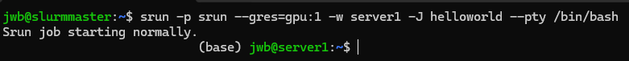
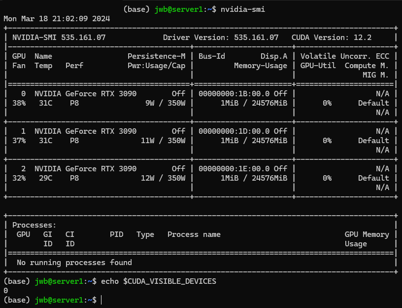
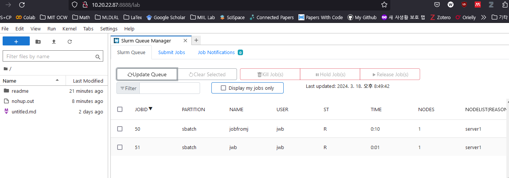

<!--
bundle exec jekyll serve --host=10.20.22.87
http://10.20.22.87:4000/miil
http://127.0.0.1:4000/miil
-->

## 전체 서버 사용량 파악

교내 접속 기준으로 `10.20.22.87:8888` 로 접속하면 JupyterLab 접속이 가능합니다.  
`HPC Cluster` extension을 실행시키면 아래 화면과 같이 전체 서버 사용 현황 파악이 가능합니다.  

## MIIL Slurm User Guide

Written by <woongbae@unist.ac.kr>. UPD 20240410  
매뉴얼 확인: <https://wbjeon2k.github.io/miil>  
ID 신쳥 현황: <https://docs.google.com/spreadsheets/d/1_GDAGOQrzGR5rvxuSb47ixEdsWmwomVn5z94GnXuFk0/edit?pli=1#gid=0>
Others: <https://github.com/wbjeon2k/readme> 원본 레포

### Overview

MIIL Slurm Cluster 사용 방법 안내입니다.  
Slurm 은 Simple Linux Utility for Resource Management 의 약자로,  
HPC 클러스터 관리를 하는 전세계 표준 도구입니다.  

사용자들은 Slurm command를 통해서 자원 요청을 하고, Slurm은 가능한 경우 자원을 할당합니다.  
자원이 모자라는 경우, 자동으로 Pending(PD) 상태가 되어서 줄을 서게 됩니다.  

해당 가이드를 통해서 우리 연구실 환경에 알맞은 Slurm 사용법을 알아봅시다.

### Disk Resource Restriction

각 사용자별로 디스크 사용량이 제한됩니다. 왼쪽의 ['Restriction'](https://wbjeon2k.github.io/miil/restriction/2024-03-16-restriction.html) 을 참조하세요.  

개인별로 용량 제한 아래에서 자유롭게 사용 가능한 `/data` 디렉토리와,  
모든 사람들이 공유를 할 수 있는 공용 데이터셋 `/dataset` 디렉토리로 나뉘어져 있습니다.  
(*`/dataset` 디렉토리는 서버 용량에 따라 없을수도 있습니다.*)

데이터셋 공유 및 개인별 디스크 사용량 제한을 통해 효율적으로 서버 디스크 관리를 하고자 합니다.  
(ImageNet 5개 중복으로 다운 받아서 1TB 잡아먹는 현상 방지, 한 사람이 1TB 사용하는 현상 방지 등)  

*데이터셋 디렉토리에 임의로 개인 대용량 파일을 저장하는 등 어뷰징하면 삭제합니다.*

### GPU Resource Restriction

**모든 GPU 사용은 Slurm을 통해서 배정 받아야 사용 가능합니다.**

일반적인 방법으로 서버에 ssh 접속을 하고 나서 `nvidia-smi`를 실행시키면 실행이 안됩니다.  
이는 시스템적인 오류가 아니라, 모든 GPU 자원은 Slurm을 거쳐서 사용하도록 만든 의도적인 설계입니다.

따라서 아래와 같은 순서로 사용하는 것을 **매우** 권장합니다.

- Programming in general: 서버에 직접 ssh 접속을 하여 프로그래밍을 합니다.
- `srun` : `srun`을 통해서 GPU를 할당받고 디버깅을 합니다.
- `sbatch` : `sbatch`를 통해서 본격적인 실험을 돌리고 기다립니다.

기타 Resource restriction policy에 대한 상세한 내용은 왼쪽의 `Restriction Policy` 글을 참조 해주세요.

## srun, sbatch

Slurm에 자원을 요청하는 방법은 크게 `srun` 과 `sbatch` 두 가지로 분류 할 수 있습니다.  
(`salloc`은 관리상 문제로 인해 제한하였습니다.)  

- `srun`: Interactive job, 즉 디버깅이 여기에 해당됩니다.
- `sbatch`: Non-interactive job, 즉 실험이 여기에 해당됩니다.

`srun` 과 `sbatch`는 사용 방법이 사뭇 다릅니다. 아래에서 자세히 설명하도록 하겠습니다.

### srun

한 줄 요약: `srun -p srun --gres=gpu:<type>:<number> -w <node name> -J <jobname> --pty /bin/bash` 을 `<user>@slurmmaster` 에 접속해서 실행.

|옵션 이름|구분|설명|상세|
|:---|:---|:---|:---|
|`--gres=gpu:<type>:<number>`|GPU 선택|GPU 모델 및 개수를 선택|`<type>` : 각 서버에서 지원하는 GPU 종류에 따라 변경. e.g. `RTX3090`, `A5000` 등 <br> `number`: 사용하고자 하는 개수|
|`-p <partition>`|파티션 선택|사용하고자 하는 파티션 선택|`srun` job은 `srun` 파티션에, `sbatch` job은 `sbatch` 파티션을 사용하도록 강제됨 <br> 해당 규칙을 지키지 않은 job은 접수 자체가 거부되거나 3분 이내로 종료됨.|
|`-w <node name>`|서버 선택|사용하고자 하는 서버 선택|안 적으면 자원 할당이 되는 서버들 중 아무거나 하나가 배당됨.|
|`-J <jobname>`|작업 이름 표시|실행하는 작업의 이름 표시|`jwb debugging` 처럼 간단하게 이름과 목적을 적어주세요. <br> 이름을 적지 않아도 누가 실행시키고 있는지는 확인할 수 있지만, 편의성 차원에서 권장 드립니다.|
|`--pty /bin/bash`|bash 실행|interactive하게 bash실행| 사실상 건드릴 이유가 딱히 없음.|

예시 1: `srun -p srun --gres=gpu:1 -w server1 --pty /bin/bash`  
예시 1 해석: 서버1의 GPU 아무거나 하나 배정해줘.

예시 2: `srun -p srun --gres=gpu:RTX3090:1 -w server1 --pty /bin/bash`  
예시 2 해석: 서버1의 GPU들 중 RTX3090을 한 개 배정해줘.

예시 3: `srun -p srun --gres=gpu:Q8000:2 -w server2 --pty /bin/bash`  
예시 3 해석: 서버2의 GPU들 중 Quadro 8000 을 두 개 배정해줘.

`srun`을 통해 배정 받은 세션을 종료하면 자동으로 작업이 끝나고 자원들이 반납됩니다!  

배정을 받기 위해서 기다리는 동안 세션 종료를 하면 역시 줄 서기가 취소됩니다.  
**`tmux` 또는 `screen` 명령어로 세션을 유지하도록 합시다.**

### sbatch

간단 요약:

```bash
#!/bin/bash
# example_job.sh
#SBATCH --job-name=<jobname>
#SBATCH --partition=sbatch # sbatch job들은 sbatch partition 사용 강제됨
#SBATCH --nodes=1
#SBATCH --nodelist=server1
#SBATCH --output=sbatch.out
#SBATCH --gres=gpu:2
# 해당 옵션들을 말로 하자면:
# 서버1에 gpu 2개를 할당 받아서 experiment.py를 실행시킬래
#
## Command(s) to run (example):

export PATH="/home/<user_id>/miniconda3/bin:$PATH"
source /home/<user_id>/.bashrc
source activate pytorch
#equivalent to conda activate pytorch

# 실행시키고자 하는 파일은 설정한 node (예시에서는 서버1) 에 실존해야하는 파일
python3 /home/<user_id>/experiment.py --options="asdf"

exit 0 # explicitly announce that job has ended
```

```bash
# slurmmaster에서 접속 후 아래 cmd 실행하면 제출 됨
sbatch example_job.sh
```

`sbatch`는 non-interactive job을 사용하는 방법입니다.  
돌려놓고 결과를 기다리기만 하면 되는, 즉 실험 같은 작업들이 여기에 해당됩니다.

`sbatch`의 중요한 두 가지 요소는 script와 option 입니다.  
`sbatch`작업 제출은 script를 통해서 이루어 집니다. 즉, `sbatch <script_name>.sh` 와 같은 cmd를 통해서 제출합니다.  
해당 script 안에는 무엇을, 어떻게 실행하는지에 대한 설명이 필요합니다.  
예를 들어, 서버1의 `/home/miil/jwb/experiment.sh` 가 '무엇을' 실행하고자 하는 대상(target) 이 됩니다.

`sbatch`작업의 option들은 `#SBATCH --<opt_name>=<opt_content>` 와 같은 형식으로 구성됩니다.
**해당 옵션들은 실행하고자 하는 cmd들 보다 먼저 선언되어야 합니다!**  
예를 들어, 위 예시 sbatch 파일의 `export PATH= ...` 전에 `#SBATCH --nodelist= ...` 옵션들의 작성이 완료 되어야 합니다.

### 잘못 제출했어요

각 job을 제출하면 `job_id` 번호를 보여줍니다.  
`scancel job_id` (`scancel 35` 등) 를 통해서 제출을 취소할 수 있습니다.  
`job_id`를 까먹었어도 괜찮습니다. 아래 '전체 서버 사용량 파악'을 통해서 알 수 있습니다.  
**자기 작업만 취소 가능합니다!**.

## 튜토리얼

### Conda

- **`slurmmaster(10.20.22.87)` 을 제외한**, `srun` 과 `sbatch`를 통해 사용하고자 하는 서버들에 conda 혹은 유사한 기능의 python venv 를 설정합시다.
- `miniconda` 설치 방법 확인. <https://conda.io/projects/conda/en/latest/user-guide/install/linux.html>  

```bash
mkdir -p ~/miniconda3
wget https://repo.anaconda.com/miniconda/Miniconda3-latest-Linux-x86_64.sh -O ~/miniconda3/miniconda.sh
bash ~/miniconda3/miniconda.sh -b -u -p ~/miniconda3
# /home/<your_user_id>/miniconda3 에 자동으로 설치.
rm -rf ~/miniconda3/miniconda.sh
# conda init && restart로 설치 반영
/home/<your_user_id>/miniconda3/bin/conda init && exec bash
```
- 여기에 적힌 방법 말고 다른 방법을 원한다면 [링크](https://velog.io/@yznny/linux%EC%97%90-Anaconda-%EC%84%A4%EC%B9%98) 등 자료를 참조하여 설치합시다.

### srun

- 자기 계정으로 서버1에 접속, conda 설치. bash 실행시 `(base) jwb@server1` 과 같이 표시되는지 확인. `ssh -p 55125 asdf@10.20.22.107`
- 자기 계정으로 관리서버 `slurmmaster(10.20.22.87)` 접속. `ssh -p 4091 asdf@10.20.22.87`
- 관리서버(10.20.22.87) 에는 conda를 깔지 않도록 주의합니다! 깔아봤자 아무 소용 없습니다.
- `srun -p srun --gres=gpu:1 -w server1 -J <작업이름> --pty /bin/bash` 실행
- 자원이 배정 되었을때, `(base) jwb@server1`과 같이 표시되면 정상입니다.
- `nvidia-smi`, `echo $CUDA_VISIBLE_DEVICES` 를 확인 해봅시다. <br> 서버 총 GPU는 3개지만, visible device는 1개임을 확인할 수 있습니다.
- <http://10.20.22.87:8888> 에 접속하여 해당 작업이 표시되는지 확인합니다. (*`Display my job only` 체크 해제*)





### sbatch

- 자기 계정으로 서버1에 접속, `/home/<user>` 에 `example_job.py`를 만들어 봅시다. <br>

  ```python
  # /home/jwb/example_job.py
  import time

  def main():
      print("starting sleep for 30 seconds")
      time.sleep(60)
      print("end sleep")

  if __name__ == "__main__":
      main()
  ```
- 자기 계정으로 마스터 서버 `slurmmaster(10.20.22.87)` 접속. `ssh -p 4091 asdf@10.20.22.87`
- 마스터 서버에서 아래와 같이 `example_job.sh` 를 만들어 봅시다. <br>
  
  ```bash
  #!/bin/bash
  # Job name:
  #SBATCH --job-name=EXAMPLEJOB
  #
  # Partition:
  #SBATCH --partition=sbatch
  #
  # Request one node:
  #SBATCH --nodes=1
  #
  # Specify the node's name
  #SBATCH --nodelist=server1
  #SBATCH --output=sbatch.out
  #SBATCH --gres=gpu:1
  # !SBATCH 제출시 GPU 최소 1개 이상 신청 해야 접수됨!
  #
  ## Command(s) to run (example):

  python3 /home/jwb/example_job.py
  ```
- `sbatch example_job.sh`를 관리서버에서 실행 시키면, <br> 신청한 자원이 할당 가능한 경우 지정한 노드(여기선 서버1) 에서 `python3 /home/jwb/example_job.py`를 실행합니다.
- 자기가 신청한 작업이 접수되어서 실행되거나(R), 대기중인지(PD) 살펴봅시다.




<!-- Make Jelly site have a GitBook look!

## Demo

Live demo on Github Pages: [https://sighingnow.github.io/jekyll-gitbook](https://sighingnow.github.io/jekyll-gitbook)

[](https://jekyll-themes.com/jekyll-gitbook/)

## Why Jekyll with GitBook

GitBook is an amazing frontend style to present and organize contents (such as book chapters
and blogs) on Web. The typical to deploy GitBook at [Github Pages][1]
is building HTML files locally and then push to Github repository, usually to the `gh-pages`
branch. It's quite annoying to repeat such workload and make it hard for people do version
control via git for when there are generated HTML files to be staged in and out.

This theme takes style definition out of generated GitBook site and provided the template
for Jekyll to rendering markdown documents to HTML, thus the whole site can be deployed
to [Github Pages][1] without generating and uploading HTML bundle every time when there are
changes to the original repo.

## How to Get Started

This theme can be used just as other [Jekyll themes][1] and support [remote theme][12],
see [the official guide][13] as well.

You can introduce this jekyll theme into your own site by either

- [Fork][3] this repository and add your markdown posts to the `_posts` folder.
- Use as a remote theme in your [`_config.yml`][14](just like what we do for this
  site itself),

```yaml
remote_theme: sighingnow/jekyll-gitbook
```

### Deploy Locally with Jekyll Serve

This theme can be ran locally using Ruby and Gemfiles.

[Testing your GitHub Pages site locally with Jekyll](https://docs.github.com/en/pages/setting-up-a-github-pages-site-with-jekyll/testing-your-github-pages-site-locally-with-jekyll) - GitHub

## Full-text search

The search functionality in jekyll-gitbook theme is powered by the [gitbook-plugin-search-pro][5] plugin and is enabled by default.

[https://sighingnow.github.io/jekyll-gitbook/?q=generated](https://sighingnow.github.io/jekyll-gitbook/?q=generated)

## Code highlight

The code highlight style is configurable the following entry in `_config.yaml`:

```yaml
syntax_highlighter_style: colorful
```

The default code highlight style is `colorful`, the full supported styles can be found from [the rouge repository][6]. Customized
style can be added to [./assets/gitbook/rouge/](./assets/gitbook/rouge/).

## How to generate TOC

The jekyll-gitbook theme leverages [jekyll-toc][4] to generate the *Contents* for the page.
The TOC feature is not enabled by default. To use the TOC feature, modify the TOC
configuration in `_config.yml`:

```yaml
toc:
    enabled: true
    h_min: 1
    h_max: 3
```

## Google Analytics, etc.

The jekyll-gitboook theme supports embedding the [Google Analytics][7], [CNZZ][8] and [Application Insights][9] website analytical tools with the following
minimal configuration in `_config.yaml`:

```yaml
tracker:
  google_analytics: "<YOUR GOOGLE ANALYTICS KEY, e.g, UA-xxxxxx-x>"
```

Similarly, CNZZ can be added with the following configuration in `_config.yaml`

```yaml
tracker:
  cnzz: "<YOUR CNZZ ANALYTICS KEY, e.g., xxxxxxxx>"
```

Application Insights can be added with the following configuration in `_config.yaml`

```yaml
tracker:
  application_insights: "<YOUR APPLICATION INSIGHTS CONNECTION STRING>"
```

## Disqus comments

[Disqus](https://disqus.com/) comments can be enabled by adding the following configuration in `_config.yaml`:

```yaml
disqushandler: "<YOUR DISQUS SHORTNAME>"
```

## Jekyll collections

Jekyll's [collections][15] is supported to organize the pages in a more fine-grained manner, e.g.,

```yaml
collections:
  pages:
    output: true
    sort_by: date
    permalink: /:collection/:year-:month-:day-:title:output_ext
```

## Extra StyleSheet or Javascript elements

You can add extra CSS or JavaScript references using configuration collections:

- extra_css: for additional style sheets. If the url does not start by http, the path must be relative to the root of the site, without a starting `/`.
- extra_header_js: for additional scripts to be included in the `<head>` tag, after the `extra_css` has been added. If the url does not start by http, the path must be relative to the root of the site, without a starting `/`.
- extra_footer_js: for additional scripts to be included at the end of the HTML document, just before the site tracking script. If the url does not start by http, the path must be relative to the root of the site, without a starting `/`.

## Customizing font settings

The fonts can be customized by modifying the `.book.font-family-0` and `.book.font-family-1` entry in [`./assets/gitbook/custom.css`][10],

```css
.book.font-family-0 {
    font-family: Georgia, serif;
}
.book.font-family-1 {
    font-family: "Helvetica Neue", Helvetica, Arial, sans-serif;
}
```

## Tips, Warnings and Dangers blocks

The jekyll-gitbook theme supports customized kramdown attributes (`{: .block-tip }`, `{: .block-warning }`,
`{: .block-danger }`) like that displayed in [the discord.js website][11]. The marker can be used like

```markdown
> ##### TIP
>
> This guide is last tested with @napi-rs/canvas^0.1.20, so make sure you have
> this or a similar version after installation.
{: .block-tip }
```

Rendered page can be previewed from

[https://sighingnow.github.io/jekyll-gitbook/jekyll/2022-06-30-tips_warnings_dangers.html](https://sighingnow.github.io/jekyll-gitbook/jekyll/2022-06-30-tips_warnings_dangers.html)

## Cover image inside pages

The jekyll-gitbook theme supports adding a cover image to a specific page by adding
a `cover` field to the page metadata:

```diff
  ---
  title: Page with cover image
  author: Tao He
  date: 2022-05-24
  category: Jekyll
  layout: post
+ cover: /assets/jekyll-gitbook/dinosaur.gif
  ---
```

The effect can be previewed from

[https://sighingnow.github.io/jekyll-gitbook/jekyll/2022-05-24-page_cover.html](https://sighingnow.github.io/jekyll-gitbook/jekyll/2022-05-24-page_cover.html)

## Diagrams with mermaid.js

This jekyll-theme supports [mermaid.js](https://mermaid.js.org/) to render diagrams
in markdown.

To enable the mermaid support, you need to set `mermaid: true` in the front matter
of your post.

```markdown
---
mermaid: true
---
```

The example can be previewed from

[https://sighingnow.github.io/jekyll-gitbook/jekyll/2023-08-31-mermaid.html](https://sighingnow.github.io/jekyll-gitbook/jekyll/2023-08-31-mermaid.html)

## License

This work is open sourced under the Apache License, Version 2.0.

Copyright 2019 Tao He.

[1]: https://pages.github.com
[2]: https://pages.github.com/themes
[3]: https://github.com/sighingnow/jekyll-gitbook/fork
[4]: https://github.com/allejo/jekyll-toc
[5]: https://github.com/gitbook-plugins/gitbook-plugin-search-pro
[6]: https://github.com/rouge-ruby/rouge/tree/master/lib/rouge/themes
[7]: https://analytics.google.com/analytics/web/
[8]: https://www.cnzz.com/
[9]: https://docs.microsoft.com/en-us/azure/azure-monitor/app/app-insights-overview
[10]: https://github.com/sighingnow/jekyll-gitbook/blob/master/gitbook/custom.css
[11]: https://discordjs.guide/popular-topics/canvas.html#setting-up-napi-rs-canvas
[12]: https://rubygems.org/gems/jekyll-remote-theme
[13]: https://docs.github.com/en/pages/setting-up-a-github-pages-site-with-jekyll/adding-a-theme-to-your-github-pages-site-using-jekyll
[14]: https://github.com/sighingnow/jekyll-gitbook/blob/master/_config.yml
[15]: https://jekyllrb.com/docs/collections/ -->
